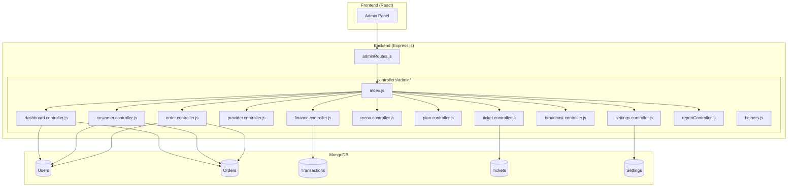
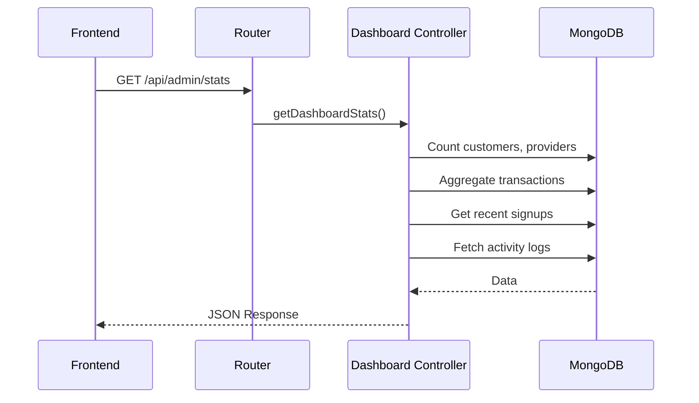
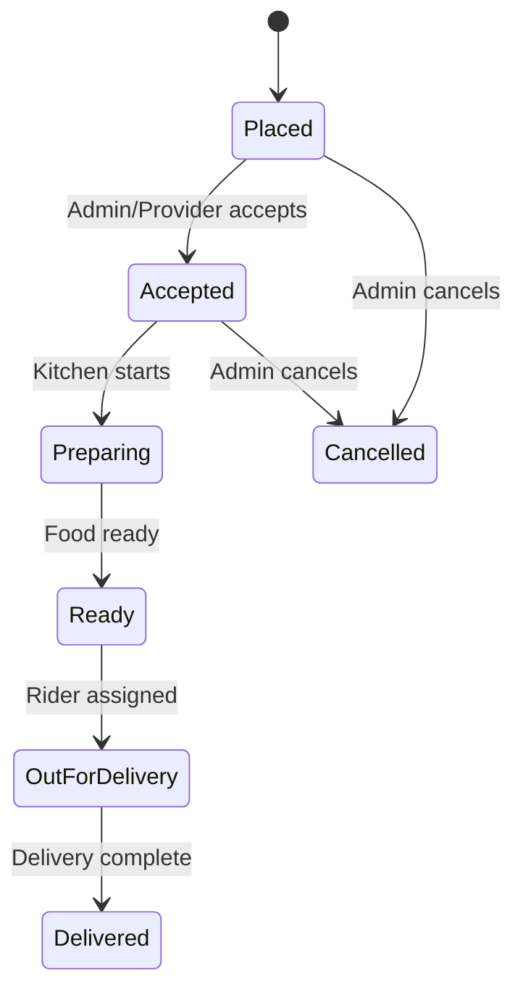
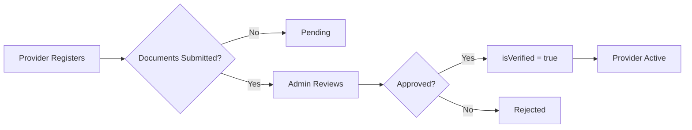
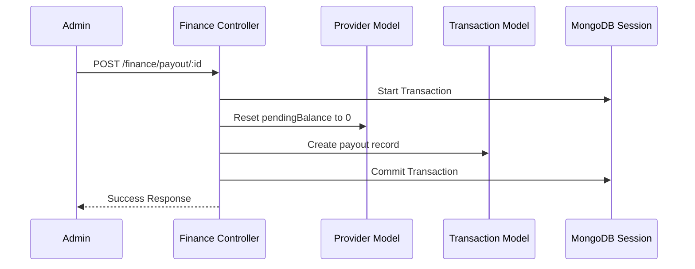
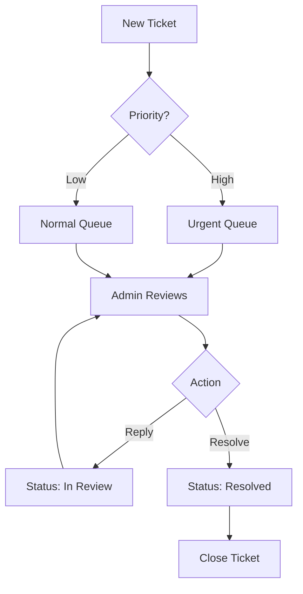

# Admin Backend Documentation

## Table of Contents
1. [Architecture Overview](#architecture-overview)
2. [File Structure](#file-structure)
3. [API Reference](#api-reference)
4. [Flow Diagrams](#flow-diagrams)

---

## Architecture Overview



---

## File Structure

### Controllers Directory

```
backend/controllers/admin/
├── index.js                  # Re-exports all controllers
├── helpers.js                # Shared utility functions
├── dashboard.controller.js   # Dashboard stats & global search
├── customer.controller.js    # Customer CRUD operations
├── order.controller.js       # Order management
├── provider.controller.js    # Provider verification & management
├── finance.controller.js     # Revenue, payouts, invoices
├── menu.controller.js        # Menu approval workflow
├── plan.controller.js        # Subscription plans
├── ticket.controller.js      # Support ticket handling
├── broadcast.controller.js   # System-wide alerts
├── settings.controller.js    # Platform configuration
└── reportController.js       # PDF/CSV report generation
```

### File Descriptions

| File | Purpose | Functions |
|------|---------|-----------|
| `index.js` | Central export point | Re-exports 30+ functions |
| `helpers.js` | Shared utilities | `createLog()`, `getOrCreateSettings()` |
| `dashboard.controller.js` | Analytics & search | `getDashboardStats()`, `globalSearch()` |
| `customer.controller.js` | Customer management | 5 CRUD functions |
| `order.controller.js` | Order tracking | 4 functions |
| `provider.controller.js` | Provider management | 5 functions |
| `finance.controller.js` | Financial operations | 4 functions |
| `menu.controller.js` | Menu approval | 3 functions |
| `plan.controller.js` | Subscription plans | 4 CRUD functions |
| `ticket.controller.js` | Support tickets | 4 functions |
| `broadcast.controller.js` | System alerts | 2 functions |
| `settings.controller.js` | Configuration | 2 functions |
| `reportController.js` | Export reports | 3 functions |

---

## API Reference

### Base URL
```
http://localhost:5000/api/admin
```

### Authentication
All routes require:
- `Authorization: Bearer <JWT_TOKEN>`
- User role: `admin`

---

### 1. Dashboard APIs

#### GET /stats
Get comprehensive dashboard statistics.

```
Response: {
  grossRevenue, adminCommission, providerPayouts,
  totalCustomers, totalProviders, liveOrders,
  salesGrowth[], recentSignups[], pendingApprovals[],
  deliveryMetrics, activityLogs[], menu, settings
}
```

#### GET /search?query=
Global search across customers, providers, orders.

---

### 2. Customer APIs

| Method | Endpoint | Description |
|--------|----------|-------------|
| GET | `/customers` | List all customers |
| POST | `/customers` | Add new customer |
| PUT | `/customers/:id` | Update customer |
| DELETE | `/customers/:id` | Delete customer |
| PUT | `/customers/:id/status` | Ban/Unban customer |

**Query Params:** `status`, `search`, `page`, `limit`

---

### 3. Order APIs

| Method | Endpoint | Description |
|--------|----------|-------------|
| GET | `/orders` | List all orders |
| PUT | `/orders/:id/status` | Update order status |
| PUT | `/orders/:id/cancel` | Cancel order |
| PUT | `/orders/:id/rider` | Assign rider |

**Query Params:** `date`, `startDate`, `endDate`, `search`

**Status Values:** `Placed`, `Accepted`, `Preparing`, `Ready`, `Out for Delivery`, `Delivered`, `Cancelled`

---

### 4. Provider APIs

| Method | Endpoint | Description |
|--------|----------|-------------|
| GET | `/providers` | List all providers |
| PUT | `/providers/:id` | Update provider |
| DELETE | `/providers/:id` | Delete provider |
| PUT | `/providers/:id/verify` | Verify/Approve provider |
| PUT | `/providers/:id/status` | Suspend/Activate |

---

### 5. Finance APIs

| Method | Endpoint | Description |
|--------|----------|-------------|
| GET | `/finance/stats` | Revenue statistics |
| GET | `/finance/payouts` | Pending payouts list |
| POST | `/finance/payout/:id` | Process payout |
| GET | `/finance/invoices` | List invoices |
| GET | `/finance/invoice/:id/download` | Download PDF |

---

### 6. Menu APIs

| Method | Endpoint | Description |
|--------|----------|-------------|
| GET | `/menus/pending` | Get pending menus |
| PUT | `/menus/:id/approve` | Approve menu |
| PUT | `/menus/:id/reject` | Reject menu |

---

### 7. Plan APIs

| Method | Endpoint | Description |
|--------|----------|-------------|
| GET | `/plans` | List all plans |
| POST | `/plans` | Create plan |
| PUT | `/plans/:id` | Update plan |
| DELETE | `/plans/:id` | Delete plan |

---

### 8. Ticket APIs

| Method | Endpoint | Description |
|--------|----------|-------------|
| GET | `/tickets` | List support tickets |
| GET | `/tickets/:id` | Get ticket details |
| PUT | `/tickets/:id/resolve` | Resolve ticket |
| POST | `/tickets/:id/reply` | Reply to ticket |

---

### 9. Broadcast APIs

| Method | Endpoint | Description |
|--------|----------|-------------|
| POST | `/broadcast` | Send system alert |
| DELETE | `/broadcast` | Clear active broadcast |

---

### 10. Settings APIs

| Method | Endpoint | Description |
|--------|----------|-------------|
| GET | `/settings` | Get platform settings |
| PUT | `/settings` | Update settings |

---

### 11. Report APIs

| Method | Endpoint | Description |
|--------|----------|-------------|
| GET | `/reports/sales/download` | Download sales CSV |
| GET | `/reports/customers/download` | Download customers CSV |

---

## Flow Diagrams

### Dashboard Stats Flow



### Order Status Flow



### Provider Verification Flow



### Finance Payout Flow



### Ticket Resolution Flow



---

## Utility Files

### helpers.js

```javascript
// Create activity log
createLog(type, description, adminId, icon, color)

// Get or create settings singleton
getOrCreateSettings()
```

### Response Helpers (utils/responseHelper.js)

```javascript
// Success response
sendSuccess(res, statusCode, message, data)

// Error response
sendError(res, statusCode, message, error)
```

### Validation Helpers (utils/validationHelper.js)

```javascript
isValidEmail(email)
isValidMobile(mobile)
isValidPassword(password)
isValidObjectId(id)
sanitizeString(str)
validateRequired(body, fields)
```

### Date Helpers (utils/dateHelper.js)

```javascript
getStartOfDay()
getEndOfDay(date)
getLastNDays(n)
formatDate(date)
formatTime(date)
```

---

## Response Format

### Success Response
```json
{
  "success": true,
  "message": "Operation successful",
  "data": { ... }
}
```

### Error Response
```json
{
  "success": false,
  "message": "Error description",
  "error": "Detailed error info"
}
```

### Paginated Response
```json
{
  "success": true,
  "data": [...],
  "pagination": {
    "currentPage": 1,
    "totalPages": 10,
    "totalItems": 100,
    "hasNext": true,
    "hasPrev": false
  }
}
```
